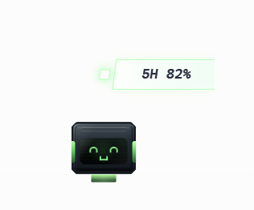
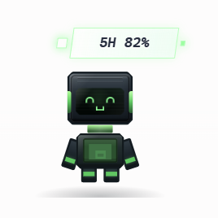
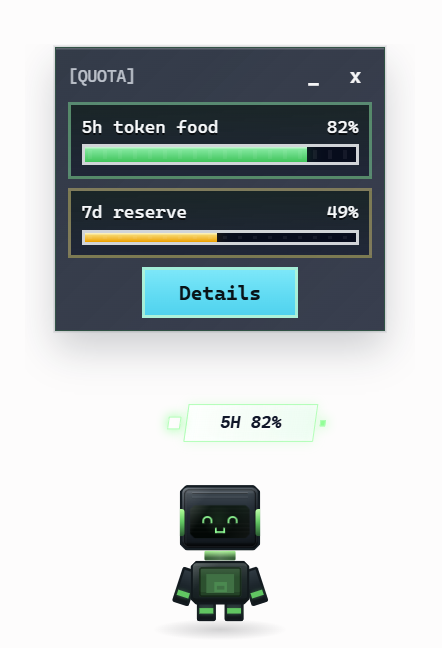
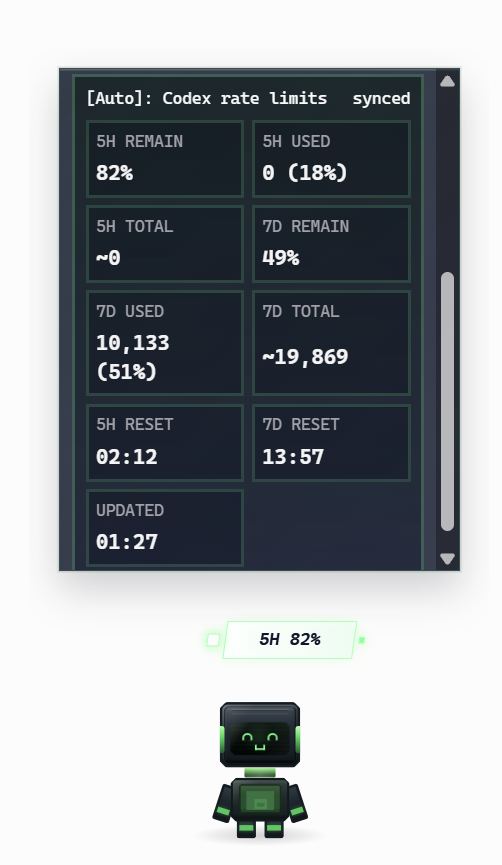
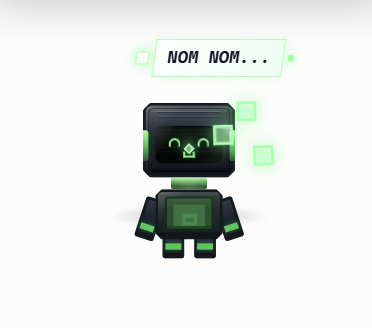

# Token Tamagotchi

**A playful desktop companion for monitoring your Codex quota, 5-hour limits, and 7-day usage pressure.**

Token Tamagotchi lives on your desktop and keeps an eye on your 5-hour limits, 7-day remaining usage, and token pressure so your workflow does not get interrupted mid-build.

Bit, the desktop companion, reacts to your quota state and treats quota as token food. When usage drops, Bit eats a token and the food meter updates.

## Why

Monitor your Codex quota without opening another dashboard.

Codex quota pressure is easiest to miss when you are already deep in a refactor, PR review, or long coding task. Token Tamagotchi turns that pressure into an ambient desktop signal you can understand at a glance.

## Current Features

- Always-on-top desktop companion.
- Automatic local Codex rate-limit reading through `codex app-server --stdio`.
- 5-hour token food and 7-day reserve meters.
- Details panel with used tokens, estimated total tokens, and reset timing.
- Auto refresh and manual refresh.
- Low quota local alerts.
- Mood, expression, and color changes based on remaining quota.
- Token-eating feedback when 5-hour quota decreases.
- Reset celebration when quota refills.
- Debug tools are hidden by default and can be explicitly enabled for local development.

## Privacy

Token Tamagotchi is local-first by design.

- It does not collect OpenAI credentials.
- It does not scrape browser dashboards or proxy traffic.
- It does not upload quota, usage, prompt, project, or local Codex data.
- It reads Codex quota from a local Codex process using `codex app-server --stdio`.
- It may read local Codex SQLite logs in read-only mode for diagnostics and usage estimates.
- It stores parsed quota snapshots locally. Raw pasted CLI text is not stored by default.

## Screenshots

### Idle Compact Mode



### Expanded Desktop Companion



### Token Food Panel



### Usage Details



### Token Eating Feedback



## Quick Start

Run all commands from the repository root.

```bash
# Install dependencies
npm install

# Launch the desktop companion
npm run tauri -- dev
```

For a production build check:

```bash
npm run build
cargo build
```

## Documentation

- [Product Blueprint](docs/product-blueprint.md)
- [PRD](docs/prd.md)
- [Architecture](docs/architecture.md)
- [Data Sources](docs/data-sources.md)
- [Parser Contract](docs/parser-contract.md)
- [Database Schema](docs/database.md)
- [MVP Acceptance Checklist](docs/mvp-acceptance-checklist.md)
- [v0.2 Acceptance Checklist](docs/v0.2-acceptance-checklist.md)
- [v0.3 Acceptance Checklist](docs/v0.3-acceptance-checklist.md)
- [v0.4 Release Checklist](docs/v0.4-release-checklist.md)
- [Roadmap](docs/roadmap.md)
- [Development Guide](docs/development-guide.md)

## Disclaimer

Token Tamagotchi is an independent open-source project. It is not an official OpenAI product.

Codex usage data shown by Token Tamagotchi should be treated as an interpreted local snapshot. The official Codex usage dashboard remains the source of truth.
